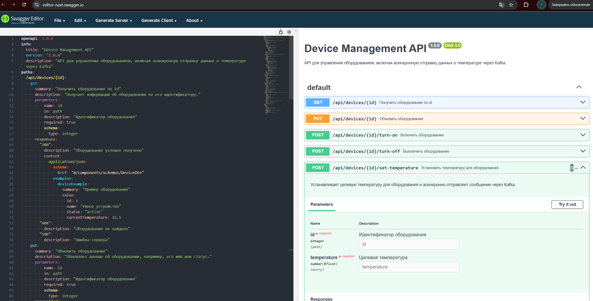
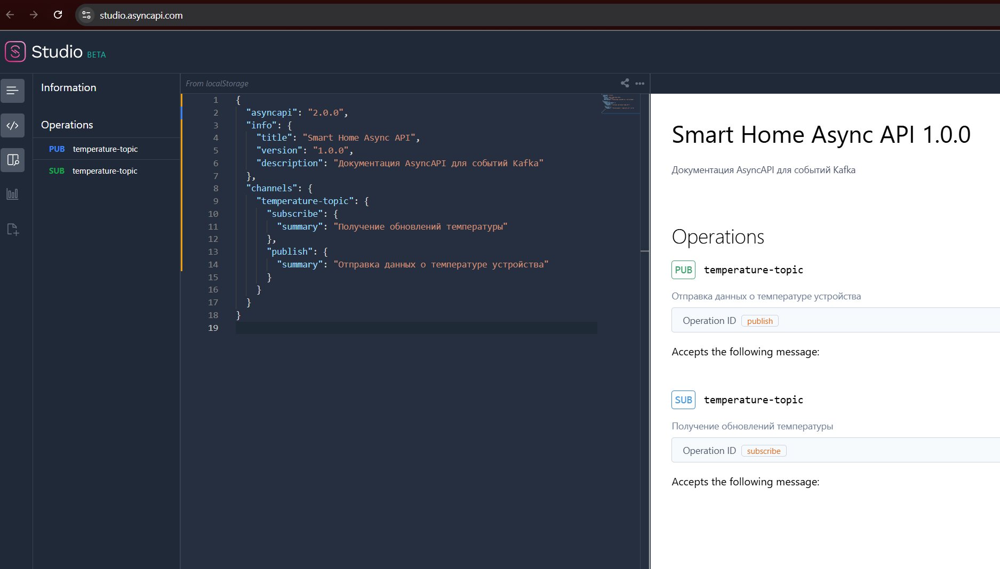

# Project_template

# Задание 1. Анализ и планирование

### 1. Описание функциональности монолитного приложения

**Управление отоплением:**

- Пользователь может включать и выключать отопление в доме через веб-интерфейс.
- Команды управления отправляются от сервера к датчику по синхронному запросу.
- Для подключения системы отопления требуется выезд специалиста.

**Мониторинг температуры:**

- Система получает данные о температуре с установленных в доме датчиков.
- Данные запрашиваются сервером у датчиков по синхронному механизму.
- Пользователь может просматривать текущую температуру в доме через веб-интерфейс.

### 2. Анализ архитектуры монолитного приложения

**Технологический стек:**

- Backend: Монолитное приложение на Java.
- База данных: PostgreSQL.
- Коммуникация с датчиками: Синхронные запросы от сервера к датчикам.
- Управление устройствами: Все команды идут централизованно через сервер.

### 3. Определение доменов и границы контекстов

1. Домен **ManagmentToolsService**

   **Описание:**
   Этот домен отвечает за контроль и управление всеми подключёнными устройствами, такими как отопительные системы, освещение, ворота и камеры наблюдения.

   **Границы контекста:**

   - Управление включением/выключением устройств.
   - Регистрация новых устройств в системе.
   - Контроль связи с устройствами и их доступности.
   - Отправка команд и обработка статуса выполнения.

2. Домен **TelemetryAggregationService**

   **Описание:**
   Этот домен занимается сбором, обработкой и анализом данных от подключённых датчиков, включая температуру, состояние устройств, потребление энергии и другие показатели.

   **Границы контекста:**

   - Получение и агрегация данных от датчиков.
   - Хранение исторических данных и логирование событий.
   - Анализ данных и генерация оповещений (например, аварийные ситуации).
   - Доступ пользователей к данным через интерфейс.

3. Домен **IdentityService**

   **Описание:**
   Этот домен управляет пользователями, их правами и аутентификацией.

   **Границы контекста:**

   - Регистрация и управление аккаунтами пользователей.
   - Настройка ролей и уровней доступа.
   - Аутентификация и авторизация (JWT, OAuth).
   - Связывание пользователей с их домами и устройствами.

4. Домен **IntegrationService**

   **Описание:**
   Этот домен отвечает за взаимодействие с оборудованием, включая поддержку сторонних устройств и протоколов.

   **Границы контекста:**

   - Интеграция с Zigbee, Z-Wave, MQTT, HTTP API.
   - Подключение сторонних производителей оборудования.
   - Унификация взаимодействия через единый API.

5. Домен **SupportService**

**Описание:**
Этот домен отвечает за техподдержку системы

**Границы контекста:**

- Регистрация обращений пользователия
- Обслуживание заявок пользователей

6. Домен **NotificationService**

**Описание:**
Этот домен отвечает за уведомления пользователям и техпподержки

**Границы контекста:**

- Отправка уведомлений о подключении
- Отправка уведомлений об изменеии различных событий

7. Домен **AnalyticsService**

**Описание:**
Этот домен отвечает за всю аналитику системы. Использует ClickHouse DB.

**Границы контекста:**

- Сбор аналитики по всем приборам

### **4. Проблемы монолитного решения**

1.  Ограниченная масштабируемость

    **Описание**:
    Масштабирование монолита возможно только горизонтально (копированием всего приложения) или вертикально (увеличением ресурсов сервера), что неэффективно.

        🔹 Пример:

          Допустим, у нас есть монолитное веб-приложение, где один модуль нагружен сильнее остальных (например, сервис авторизации). Мы не можем масштабировать только этот сервис, нам придется дублировать весь монолит, что приводит к лишним затратам.

2.  Сложность внедрения новых технологий

    **Описание**:
    Любое изменение в стек технологий затрагивает весь монолит. Обновление зависимостей, библиотеки или языка программирования требует переписывания всей системы.

        🔹 Пример:

            Допустим, в монолите старая версия Java, которая не позврояет использовать современные библиотеки.

3.  Долгий процесс деплоя и тестирования

    **Описание**:
    Любое изменение требует пересборки и перезапуска всего приложения. Даже если исправлен только один небольшой баг, вся система должна пройти тестирование и развертывание.

        🔹 Пример:

            Допустим, мы сделали опечатку в одном слове. Нужно пересобирать весь монолит и прогонять все тесты проекта

4.  Усложнение разработки и поддержки

    **Описание**:
    Большой кодовый базис приводит к тому, что разработчикам сложно разбираться в системе. Из-за высокой связанности компонентов любое изменение может затронуть неожиданные части приложения.

        🔹 Пример:

            Новый разработчик пытается изменить логику аутентификации, но это неожиданно ломает функциональность корзины в интернет-магазине, так как они используют общий сервис пользователей.

5.  Проблемы отказоустойчивости

    **Описание**:
    Если один компонент ломается, может перестать работать вся система.

    🔹 Пример:

        Если в монолите завис сервис авторизации, то все пользователи не могут войти в систему, а значит, недоступен и основной функционал (например, заказы или платежи).

**_Вывводы_**

Монолитная архитектура может работать на старте проекта, но с ростом системы появляются серьезные ограничения:

- ✔ Сложное масштабирование
- ✔ Долгие релизы и тестирование
- ✔ Слабая отказоустойчивость
- ✔ Проблемы с внедрением новых технологий
- ✔ Затрудненная командная работа

🚀 Микросервисная архитектура решает эти проблемы, разбивая систему на независимые сервисы с четкими границами.

### 5. Визуализация контекста системы — диаграмма С4

// За основу. https://github.com/plantuml-stdlib/C4-PlantUML/blob/master/samples/C4_Sequence%20Diagram%20Sample%20-%20complex.puml

# Задание 2. Проектирование микросервисной архитектуры

**Диаграмма контейнеров (Containers)**

**Диаграмма компонентов (Components)**

**Диаграмма кода (Code)**

# Задание 3. Разработка ER-диаграммы

# ✅  Задание 4. Создание и документирование API

### 1. Тип API

Для взаимодействия между микросервисами я предлагаю использовать комбинированный подход:

**REST API (синхронное взаимодействие)**:
Используется для операций, где требуется мгновенный ответ, например, получение информации об устройстве или обновление его состояния. REST API обеспечивает понятный контракт, широко поддерживается и легко тестируется с помощью таких инструментов, как Swagger.

**AsyncAPI (асинхронное взаимодействие через Kafka)**:
Применяется для сценариев, где микросервисы обмениваются событиями или уведомлениями (например, отправка данных о температуре). Асинхронный подход позволяет не блокировать выполнение, повышает масштабируемость и надёжность системы, особенно когда обмен сообщениями не требует немедленного ответа.

**Решение обосновано тем, что**:

REST API обеспечивает быстрый и явный обмен данными для запросов/ответов, что удобно для синхронных операций, требующих непосредственного подтверждения.
AsyncAPI через Kafka позволяет эффективно обрабатывать события и уведомления, снижая зависимость между микросервисами и обеспечивая гибкость при масштабировании.
Таким образом, комбинированный подход позволяет использовать сильные стороны каждого типа API в зависимости от конкретного сценария взаимодействия микросервисов.

### 2. Документация API

⚠️ Проект со свагером не запускается, сделаны моковые файлы.

Был сделан моковый контролдер [DeviceController](./diagrams/task_4/DeviceController.java) , который реализует 5 эндпоинтов.
В нем для описания REST API документации используется `import io.swagger;`. Каждый эндпоинт имеет декоратор **ApiOperation** с описанием метода.

Также, для описания асинхронного взаимодействия используются пакеты **<groupId>io.github.springwolf</groupId>** и
**<groupId>org.springdoc</groupId>** описанные в файле для установки 

- Сделана папка Kafka с конфигом [KafkaConfig](./diagrams/task_4//kafka/KafkaConfig.java)
- Сделан файл **Producer** [KafkaProducerService](./diagrams/task_4/kafka/KafkaProducerService.java)
- Сделан файл **Consumer** [KafkaConsumerService](./diagrams/task_4/kafka/KafkaConsumerService.java)

1. Json файл для документации синхронных запросов 
   

2. Yaml файл для документации асинхронных запросов 
   
